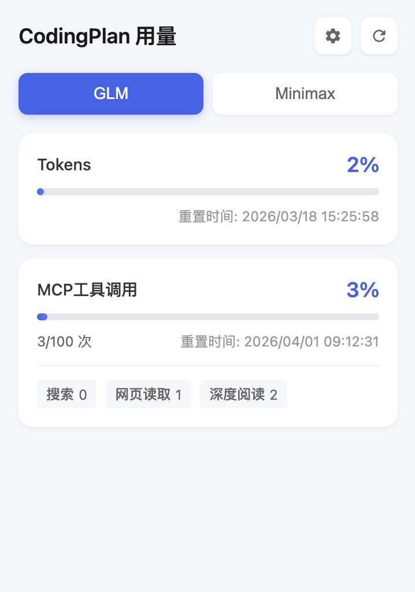
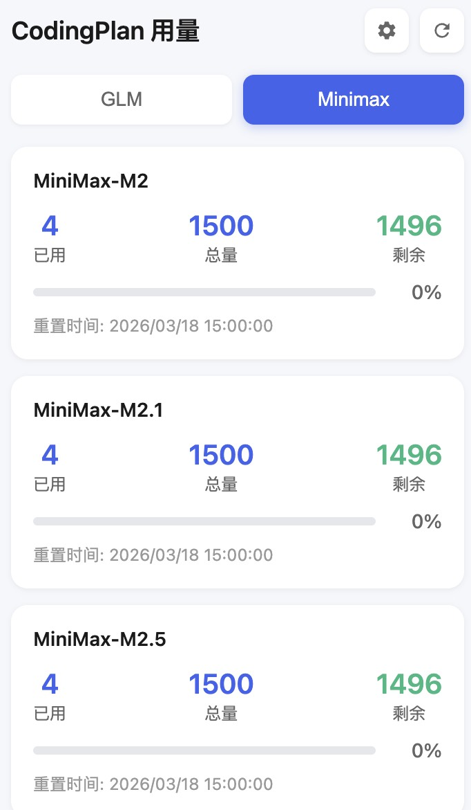
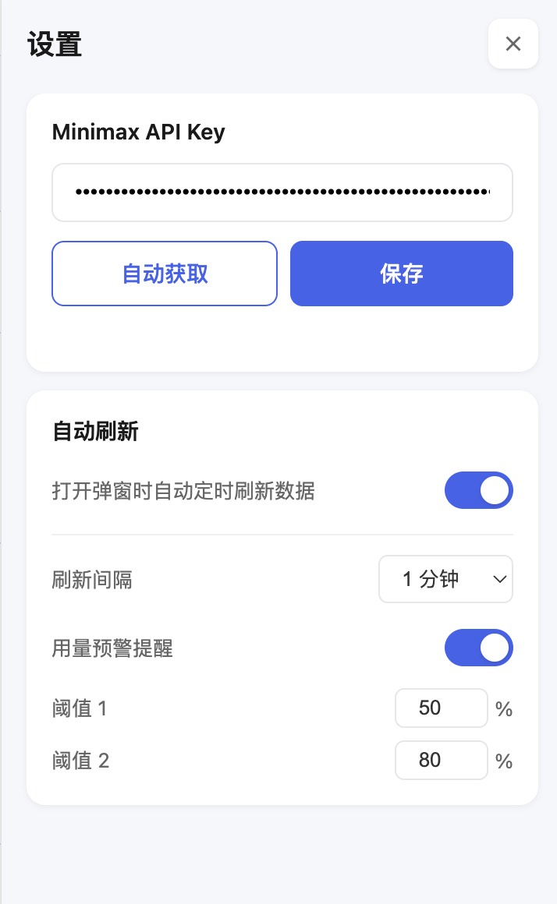

# CodingPlan 用量查询

一款 Chrome 浏览器扩展，用于快速查询智谱 GLM 和 MiniMax 编码套餐的用量信息。

## 功能截图

| GLM 用量查询 | MiniMax 用量查询 | 设置页面 |
|:---:|:---:|:---:|
|  |  |  |

## 功能特性

- **GLM 用量查询** — 实时查看 Tokens 消耗量和 MCP 工具调用次数，支持查看各工具（搜索、网页读取、深度阅读）的详细用量
- **MiniMax 用量查询** — 查看各模型的已用/总量/剩余额度，支持自动获取 API Key
- **用量预警提醒** — 设置阈值（默认 25%、50%、75%），用量超标时自动弹出桌面通知
- **自动定时刷新** — 可配置 1~10 分钟间隔自动刷新数据
- **数据缓存** — 本地缓存上次查询结果，打开弹窗即可快速查看

## 安装方式

1. 下载或克隆本项目
2. 打开 Chrome，进入 `chrome://extensions/`
3. 开启右上角 **开发者模式**
4. 点击 **加载已解压的扩展程序**，选择 `chrome-extension` 目录

## 使用说明

### GLM

点击扩展图标，默认显示 GLM 面板。首次使用需登录 [智谱开放平台](https://bigmodel.cn)，扩展会自动读取登录状态获取用量数据。

### MiniMax

切换到 MiniMax 标签页。扩展会尝试自动获取 API Key；如未登录，可点击「前往设置」手动配置，或点击「自动获取」从 [MiniMax 平台](https://platform.minimaxi.com) 自动拉取。

### 设置

点击右上角齿轮图标可配置：

- **Minimax API Key** — 手动输入或自动获取
- **自动刷新** — 开启/关闭定时刷新及间隔时间
- **用量预警** — 开启/关闭预警通知及自定义阈值

## 项目结构

```
chrome-extension/
├── manifest.json              # 扩展配置（Manifest V3）
├── icons/                     # 扩展图标
├── background/
│   └── service-worker.js      # 后台服务：Cookie 获取与 API 代理
└── popup/
    ├── popup.html             # 弹窗页面
    ├── popup.css              # 样式
    └── popup.js               # 弹窗交互逻辑
```

## 权限说明

| 权限 | 用途 |
|------|------|
| `cookies` | 读取 bigmodel.cn 和 minimaxi.com 的登录状态 |
| `storage` | 本地存储 API Key、缓存数据和用户设置 |
| `notifications` | 用量超过预警阈值时发送桌面通知 |

## 技术栈

- Chrome Extension Manifest V3
- 原生 JavaScript（无框架依赖）
- Service Worker 后台服务
